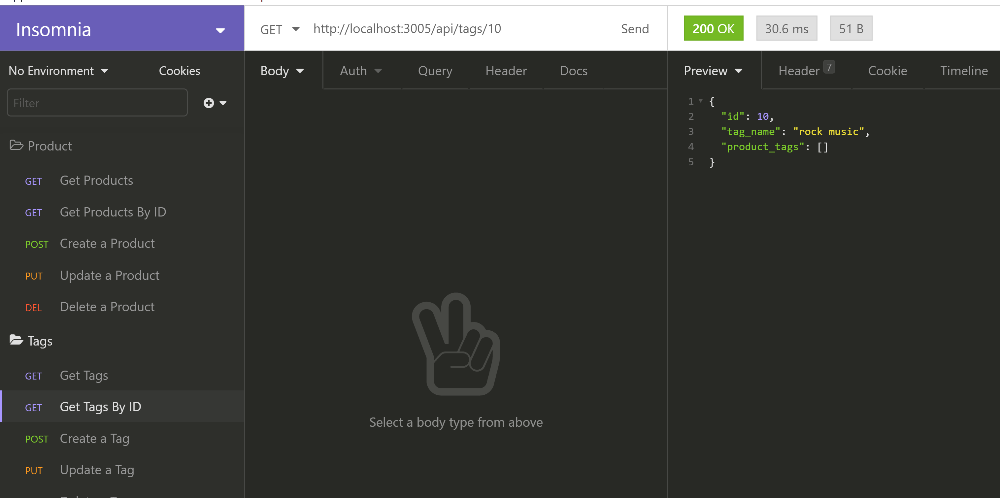
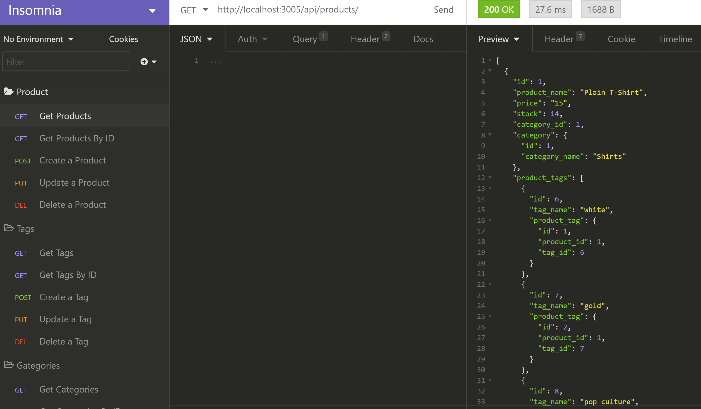

# E-commerce-Back-End

## Description

This is an app which will allow a user to connect to the api and have the ability to create, read, update, and delete categories, tags, and products for the store.

## Table of Contents

- [Installation](#installation)
- [Usage](#usage)
- [Instructions](#instructions)
- [Credits](#questions)

## Installation

Clone this project on your local machine.

## Usage

This project is for anyone wants a back-end api for their front-end site

## Instructions

- Step 1: Clone this repository
- Step 2: Install dependencies with 'npm install'
- Step 3: Create .env file
- Step 4: Login to your mysql server and type 'source db/schema.sql
- Step 5: Run 'npm run seed' to create preset categories, tags, and products
- Step 6: Type 'npm start' to start the server
- Step 7: Open Insomnia core
- Step 8: You can create, read, update, and delete categories, tags, and products

## Credits

Created by: [irina256](https://github.com/irina256)

